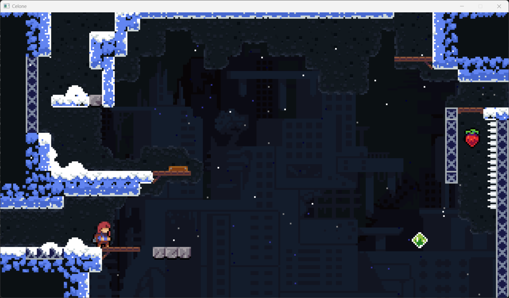
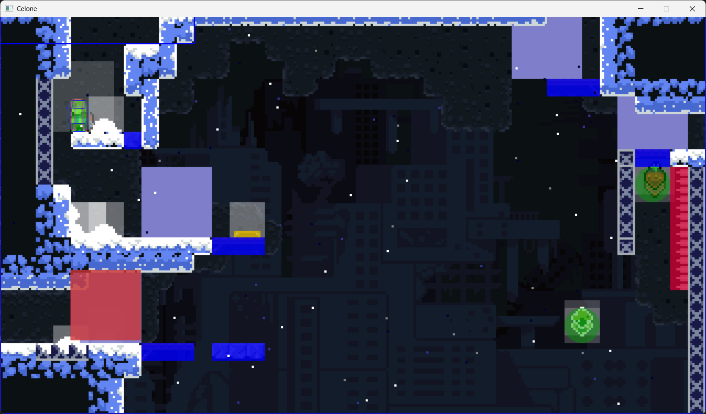
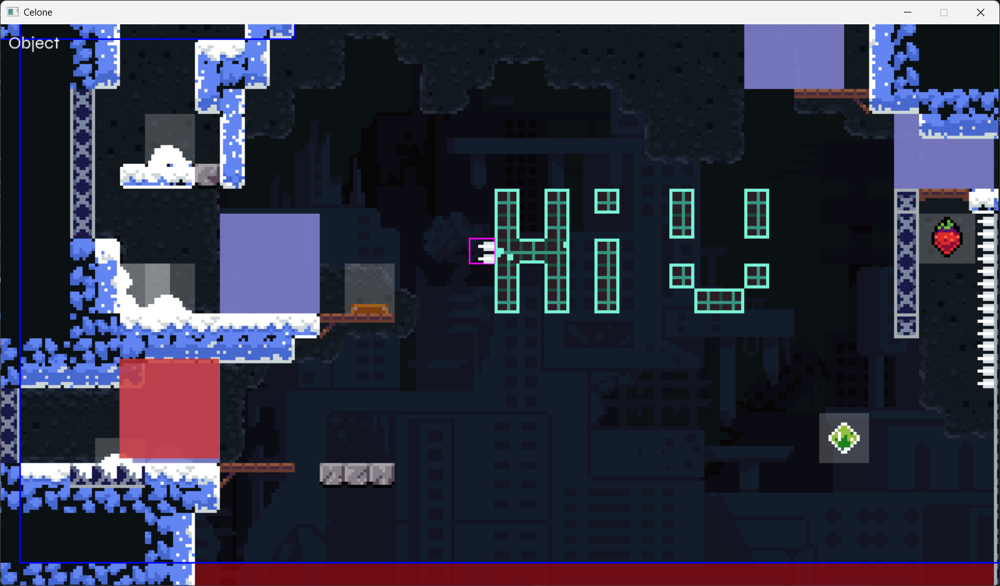

# Celone
A very basic Celeste clone written from scratch in C++ by a student (me). Includes a level editor.

Please not that this is an educational project that was written in a very short time. The project is unfinished at best, and very buggy at worst. It lacks a ton of features that I never got to implementing and I do not intend to continue working on this.

This project was meant to teach me more of the ropes of C++ and thus the code contains some bad practice and hacked together duct-tape in an attempt to finish something before the deadline.

## Screenshots
### Play Mode

### Debug Mode

### Edit Mode

## Building
To build the project, install Visual Studio with the C++ development toolchain, open the solution and choose a configuration to run.

Please note that the release configuration is broken, and as of this time I have no intention to continue working on this project.

## How to play
My implementation of the game has 2 modes: play and edit, you can switch between modes live by simply pressing tab. The control schemes for both modes will be listed here.

### Controls
- Tab to switch mode

#### Play
- F1 to toggle debug mode
- a & d to move
- space to jump
- Shift to dash in the direction you are looking
- w & s to climb up or down (or crouch when grounded)
- j to grab
- a & d against a wall to wall slide

#### Edit
- wasd (or drag with middle mouse) to pan the camera
- z & x to zoom the camera
- q and e to switch editor tools
- space to save the level
- LMB, RMB and scrolling are tool-specific
- g to place the player spawn location

##### Tools
- Tilemap (there are 2 tilemap tools, front tilemap and back tilemap), LMB to place, RMB to remove, scroll to select tile
- Camera click and drag to draw camera rectangles, when a player enters one of these, the camera moves to the bottom left of the rectangle the player is in. RMB inside a rectangle to remove it
- Deathzone tool, this tool is used to mark areas in which the player should die
- Object tool, the tool responsible for placing and managing objects
- Background tool, this tool is used to mark the area used in the background calculation 
- Cassette tool, this tool is used to mark the cassette music area

## Acknowledgments
Please note that this project does not intend to impersonate, copy or redistribute a version of the original game. It is simply an educational project made for school and should never be treated as more than that.

I used the following resources as a guide for making this project:

- [Celeste Wiki](https://celeste.ink/wiki/)
- [Celeste Analysis](https://aran.ink/posts/celeste-tilesets)
- [Celeste Asset Extractor](https://github.com/TeWu/CelesteExtractor/releases)